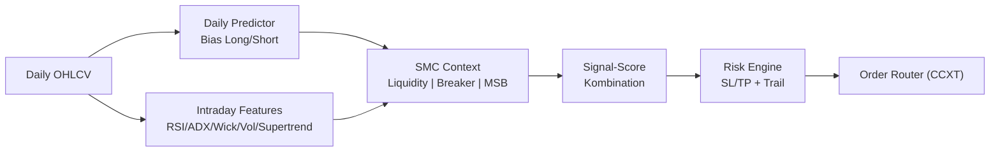

# ⚡ PBot - Smart Money Concepts Trading Bot

<div align="center">


[](https://www.python.org/)
[](https://github.com/ccxt/ccxt)
[](LICENSE)

**Ein professioneller Trading-Bot basierend auf Smart Money Concepts mit Predictor-Score und fortgeschrittener technischer Analyse**

[Features](#-features) • [Installation](#-installation) • [Konfiguration](#-konfiguration) • [Live-Trading](#-live-trading) • [Pipeline](#-interaktives-pipeline-script) • [Monitoring](#-monitoring--status) • [Wartung](#-wartung)

</div>

---

## 📊 Übersicht

PBot ist ein hochentwickelter Trading-Bot, der Smart Money Concepts (SMC) mit klassischer technischer Analyse kombiniert. Das System nutzt Daily-Candle-Predictor-basierte Signale mit Multi-Indikator-Ansatz (RSI, ADX, Volume, Supertrend) für präzise Ein- und Ausstiegspunkte bei professioneller Risikokontrolle.

### 🧭 Trading-Logik (Kurzfassung)
- **Daily Predictor**: Prognostiziert die nächste Daily-Candle-Richtung (Long/Short Bias) und legt das Grund-Sentiment fest
- **SMC-Core**: Identifiziert Liquiditätszonen, Breaker-Blocks und Marktstrukturbrüche
- **Predictor-Score**: RSI + Wick-Analyse + Volumen-Ratio + Supertrend werden gewichtet kombiniert
- **Multi-Timeframe**: Höherer Timeframe dient als Bias-Filter (nur Trades in Trendrichtung)
- **Risk Layer**: Dynamischer SL/TP basierend auf Volatilität und Konto-Risk; optionales Trailing
- **Execution**: CCXT für Order-Platzierung mit realistischer Slippage-Simulation

### 🔍 Strategie-Visualisierung


### 📈 Trade-Beispiel (Entry/SL/TP)
- **Bias**: Daily Predictor = Long Signal
- **Entry**: Intraday Breaker-Block + RSI > 50 + ADX > 20; Volumen-Ratio > Schwelle
- **Initial SL**: Unter Liquidity Sweep Low oder letztem Swing-Low
- **TP**: 2–3×SL-Distanz oder strukturelles Target (vorriges High)
- **Trailing**: Nach +1×SL Distanz Trail unter letztes Higher Low nachziehen

---

## 🚀 Features

### Trading Features
- ✅ Smart Money Concepts Implementierung
- ✅ Daily-Predictor-basierte Signalgenerierung
- ✅ Unterstützt mehrere Kryptowährungspaare (BTC, ETH, SOL, etc.)
- ✅ Multi-Timeframe-Analyse (MTF) für höhere Genauigkeit
- ✅ RSI, ADX und Volume-Filter Integration
- ✅ Dynamisches Position Sizing
- ✅ Intelligentes Stop-Loss/Take-Profit Management
- ✅ Telegram-Benachrichtigungen

### Technical Features
- ✅ CCXT Integration für mehrere Börsen
- ✅ Optuna Hyperparameter-Optimierung
- ✅ Wick-basierte Signalvalidierung
- ✅ Volume-Ratio-Analyse
- ✅ Backtesting mit realistischer Slippage-Simulation
- ✅ Walk-Forward-Analyse
- ✅ Feature-Importance-Analyse

---

## 📋 Systemanforderungen

### Hardware
- **CPU**: Multi-Core Prozessor (Intel i5 oder besser empfohlen)
- **RAM**: Minimum 4GB, empfohlen 8GB+
- **Speicher**: 2GB freier Speicherplatz

### Software
- **OS**: Linux (Ubuntu 20.04+), macOS, Windows 10/11
- **Python**: Version 3.8 oder höher
- **Git**: Für Repository-Verwaltung

---

## 💻 Installation

### 1. Repository klonen

```bash
git clone https://github.com/Youra82/pbot.git
cd pbot
```

### 2. Automatische Installation (empfohlen)

```bash
# Linux/macOS
chmod +x install.sh
./install.sh

# Windows (PowerShell)
python -m venv .venv
.venv\Scripts\activate
pip install -r requirements.txt
```

Das Installations-Script führt folgende Schritte aus:
- ✅ Erstellt eine virtuelle Python-Umgebung (`.venv`)
- ✅ Installiert alle erforderlichen Abhängigkeiten
- ✅ Erstellt notwendige Verzeichnisse (`data/`, `logs/`, `artifacts/`)
- ✅ Initialisiert Konfigurationsdateien

### 3. API-Credentials konfigurieren

Erstelle eine `secret.json` Datei im Root-Verzeichnis:

```json
{
  "pbot": [
    {
      "name": "Binance Trading Account",
      "exchange": "binance",
      "apiKey": "DEIN_API_KEY",
      "secret": "DEIN_SECRET_KEY",
      "options": {
        "defaultType": "future"
      }
    }
  ]
}
```

⚠️ **Wichtig**: 
- Niemals `secret.json` committen oder teilen!
- Verwende nur API-Keys mit eingeschränkten Rechten
- Aktiviere IP-Whitelist auf der Exchange

### 4. Trading-Strategien konfigurieren

Bearbeite `settings.json`:

```json
{
  "live_trading_settings": {
    "active_strategies": [
      {
        "symbol": "BTC/USDT:USDT",
        "timeframe": "4h",
        "higher_timeframe": "1d",
        "use_mtf_filter": true,
        "active": true
      },
      {
        "symbol": "ETH/USDT:USDT",
        "timeframe": "1h",
        "higher_timeframe": "4h",
        "use_mtf_filter": true,
        "active": true
      }
    ]
  }
}
```

**Parameter-Erklärung**:
- `symbol`: Handelspaar
- `timeframe`: Einstiegs-Timeframe
- `higher_timeframe`: Filter-Timeframe für MTF-Bias
- `use_mtf_filter`: Multi-Timeframe-Filter aktivieren
- `active`: Strategie aktiv

---

## 🔴 Live Trading

### Start des Live-Trading

```bash
# Master Runner starten
python master_runner.py
```

### Manuell starten / Cronjob testen

```bash
cd /home/ubuntu/pbot && /home/ubuntu/pbot/.venv/bin/python3 /home/ubuntu/pbot/master_runner.py
```

Der Master Runner:
- ✅ Lädt Konfigurationen aus `settings.json`
- ✅ Berechnet Daily Predictor-Signale
- ✅ Startet separate Prozesse für aktive Strategien
- ✅ Überwacht Kontostand und verfügbares Kapital
- ✅ Managed Positionen und Risk-Limits
- ✅ Loggt alle Trading-Aktivitäten
- ✅ Sendet Telegram-Benachrichtigungen

### Automatischer Start (Produktions-Setup)

```bash
crontab -e
```

```
# Starte den PBot Master-Runner alle 15 Minuten
*/15 * * * * /usr/bin/flock -n /home/ubuntu/pbot/pbot.lock /bin/sh -c "cd /home/ubuntu/pbot && /home/ubuntu/pbot/.venv/bin/python3 /home/ubuntu/pbot/master_runner.py >> /home/ubuntu/pbot/logs/cron.log 2>&1"
```

Logverzeichnis:

```bash
mkdir -p /home/ubuntu/pbot/logs
```


---

## 📊 Interaktives Pipeline-Script

Das **`run_pipeline.sh`** Script automatisiert die Parameter-Optimierung für deine Strategien. Es führt Optuna-basierte Hyperparameter-Suche durch und findet die optimalen SMC- und Predictor-Einstellungen.

### Features des Pipeline-Scripts

✅ **Interaktive Eingabe** - Einfache Menü-Navigation  
✅ **Automatische Datumswahl** - Zeitrahmen-basierte Lookback-Berechnung  
✅ **Optuna-Optimierung** - Bayessche Hyperparameter-Suche  
✅ **Batch-Optimierung** - Mehrere Symbol/Timeframe-Kombinationen  
✅ **Automatisches Speichern** - Optimale Konfigurationen  
✅ **Integrierte Backtests** - Sofort nach Optimierung testen  

### Verwendung

```bash
chmod +x run_pipeline.sh
./run_pipeline.sh
```

### Optimierte Konfigurationen

```
artifacts/optimal_configs/
├── optimal_BTCUSDT_4h.json
├── optimal_BTCUSDT_1h.json
└── ...
```

**Beispiel-Konfiguration**:

```json
{
  "symbol": "BTCUSDT",
  "timeframe": "4h",
  "parameters": {
    "rsi_period": 14,
    "rsi_weight": 0.3,
    "adx_threshold": 25,
    "volume_ratio": 1.5,
    "supertrend_atr": 10,
    "sl_atr_multiplier": 2.0,
    "tp_rr_ratio": 2.5
  },
  "performance": {
    "total_return": 8.75,
    "win_rate": 62.5,
    "num_trades": 16,
    "max_drawdown": -7.25,
    "end_capital": 708.75
  }
}
```

---

## 📊 Monitoring & Status

### Status-Dashboard

```bash
./show_status.sh
```

### Log-Files

```bash
tail -f logs/cron.log
tail -f logs/error.log
tail -n 100 logs/pbot_BTCUSDTUSDT_4h.log
```


---

## 🛠️ Wartung & Pflege

### Logs ansehen

```bash
tail -f logs/cron.log
tail -n 200 logs/cron.log
grep -i "ERROR" logs/cron.log
```

### Bot aktualisieren

```bash
chmod +x update.sh
bash ./update.sh
```

### 🔧 Config-Management

#### Konfigurationsdateien löschen

Bei Bedarf können alle generierten Konfigurationen gelöscht werden:

```bash
rm -f src/pbot/strategy/configs/config_*.json
```

#### Löschung verifizieren

```bash
ls -la src/pbot/strategy/configs/config_*.json 2>&1 || echo "✅ Alle Konfigurationsdateien wurden gelöscht"
```


### Tests ausführen

```bash
./run_tests.sh
pytest tests/test_strategy.py -v
pytest --cov=src tests/
```

---

## � Auto-Optimizer Verwaltung

Der Bot verfügt über einen automatischen Optimizer, der wöchentlich die besten Parameter für alle aktiven Strategien sucht.

### Optimizer manuell triggern

Um eine sofortige Optimierung zu starten (ignoriert das Zeitintervall):

```bash
# Letzten Optimierungszeitpunkt löschen (erzwingt Neustart)
rm /home/ubuntu/pbot/data/cache/.last_optimization_run

# Master Runner starten (prüft ob Optimierung fällig ist)
cd /home/ubuntu/pbot && .venv/bin/python3 master_runner.py
```

### Optimizer-Logs überwachen

```bash
# Optimizer-Log live mitverfolgen
tail -f /home/ubuntu/pbot/logs/optimizer_output.log

# Letzte 50 Zeilen des Optimizer-Logs anzeigen
tail -50 /home/ubuntu/pbot/logs/optimizer_output.log
```

### Optimierungsergebnisse ansehen

```bash
# Beste gefundene Parameter anzeigen (erste 50 Zeilen)
cat /home/ubuntu/pbot/artifacts/results/optimization_results.json | head -50
```

### Optimizer-Prozess überwachen

```bash
# Prüfen ob Optimizer gerade läuft (aktualisiert jede Sekunde)
watch -n 1 "ps aux | grep optimizer"
```

---

## �📂 Projekt-Struktur

```
pbot/
├── src/
│   └── pbot/
│       ├── strategy/          # Trading-Logik
│       │   ├── run.py
│       │   ├── smc_detector.py
│       │   └── predictor.py
│       ├── backtest/          # Backtesting
│       │   └── backtester.py
│       └── utils/             # Hilfsfunktionen
│           ├── exchange.py
│           └── telegram.py
├── scripts/
├── tests/
├── data/
├── logs/
├── artifacts/
├── master_runner.py
├── settings.json
├── secret.json
└── requirements.txt
```

---

## ⚠️ Wichtige Hinweise

### Risiko-Disclaimer

⚠️ **Trading mit Kryptowährungen birgt erhebliche Risiken!**

- Nur Kapital einsetzen, dessen Verlust Sie verkraften können
- Keine Garantie für Gewinne
- Vergangene Performance ist kein Indikator
- Testen Sie mit Demo-Accounts
- Starten Sie mit kleinen Beträgen

### Security Best Practices

- 🔐 Keine API-Keys mit Withdrawal-Rechten
- 🔐 IP-Whitelist aktivieren
- 🔐 2FA verwenden
- 🔐 `secret.json` niemals committen
- 🔐 Regelmäßige Updates

### Performance-Tipps

- 💡 Starten Sie mit 1-2 Strategien
- 💡 Längere Timeframes für stabilere Signale
- 💡 Monitoren Sie regelmäßig
- 💡 Parameter regelmäßig optimieren
- 💡 Position-Sizing angemessen konfigurieren

---

## 🤝 Support & Community

### Probleme melden

1. Prüfen Sie die Logs
2. Führen Sie Tests aus
3. Öffnen Sie ein Issue

### Updates

```bash
git fetch origin
./update.sh
```

### Hochladen

```bash
git add artifacts/optimal_configs/*.json
git commit -m "Update: Optimierte Parameter"
git push origin main
```

---

## 🤖 Auto-Optimizer Scheduler

Automatische Optimierung der Strategie-Konfigurationen nach Zeitplan mit Telegram-Benachrichtigungen.

### Schnellstart-Befehle

```bash
# Status prüfen (wann ist die nächste Optimierung fällig?)
python3 auto_optimizer_scheduler.py --check-only

# Sofort optimieren (ignoriert Zeitplan)
python3 auto_optimizer_scheduler.py --force

# Als Daemon laufen (prüft alle 60 Sekunden)
python3 auto_optimizer_scheduler.py --daemon

# Daemon mit längerem Intervall (alle 5 Minuten)
python3 auto_optimizer_scheduler.py --daemon --interval 300
```

### Konfiguration (settings.json)

```json
{
    "optimization_settings": {
        "enabled": true,
        "schedule": {
            "_info": "day_of_week: 0=Montag, 6=Sonntag | hour: 0-23 (24h Format)",
            "day_of_week": 0,
            "hour": 3,
            "minute": 0,
            "interval_days": 7
        },
        "symbols_to_optimize": "auto",
        "timeframes_to_optimize": "auto",
        "lookback_days": 365,
        "num_trials": 500,
        "send_telegram_on_completion": true
    }
}
```

| Parameter | Beschreibung |
|-----------|--------------|
| `enabled` | Automatische Optimierung aktivieren |
| `day_of_week` | 0=Montag, 1=Dienstag, ..., 6=Sonntag |
| `hour` | Stunde (0-23) |
| `interval_days` | Mindestabstand in Tagen |
| `symbols_to_optimize` | `"auto"` = aus active_strategies, oder `["BTC", "ETH"]` |
| `timeframes_to_optimize` | `"auto"` = aus active_strategies, oder `["1h", "4h"]` |

### Auto-Modus

Bei `"auto"` werden Symbole und Timeframes automatisch aus den aktiven Strategien extrahiert:

```json
"active_strategies": [
    {"symbol": "BTC/USDT:USDT", "timeframe": "4h", "active": true},
    {"symbol": "ETH/USDT:USDT", "timeframe": "1h", "active": false}
]
```
→ Optimiert nur: **BTC** mit **4h** (ETH ist nicht aktiv)

---

## 📜 Lizenz

Dieses Projekt ist lizenziert unter der MIT License.

---

## 🙏 Credits

Entwickelt mit:
- [CCXT](https://github.com/ccxt/ccxt)
- [Optuna](https://optuna.org/)
- [Pandas](https://pandas.pydata.org/)
- [TA-Lib](https://github.com/mrjbq7/ta-lib)

---

<div align="center">

**Made with ❤️ by the PBot Team**

⭐ Star uns auf GitHub wenn dir dieses Projekt gefällt!

[🔝 Nach oben](#-pbot---smart-money-concepts-trading-bot)

</div>
